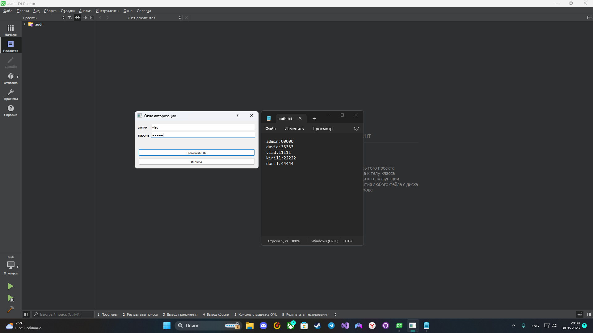
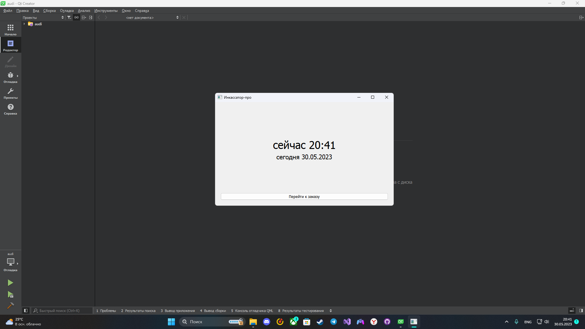
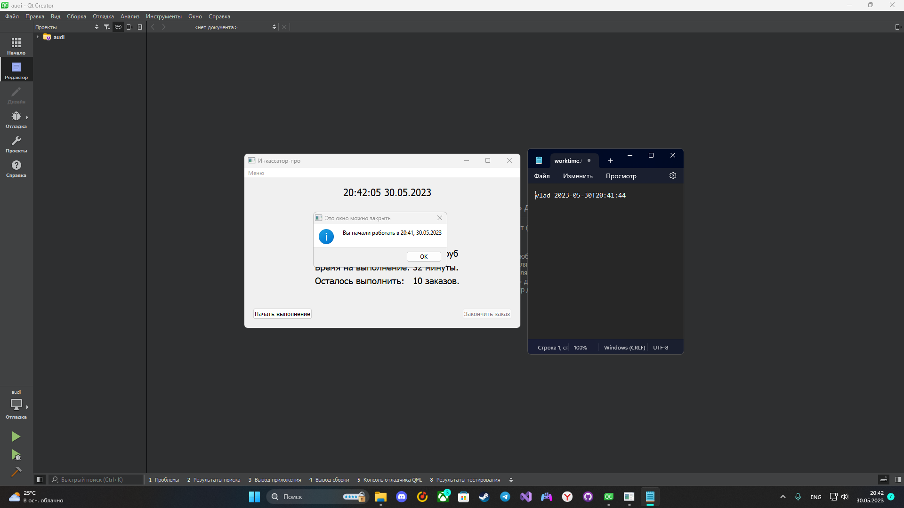
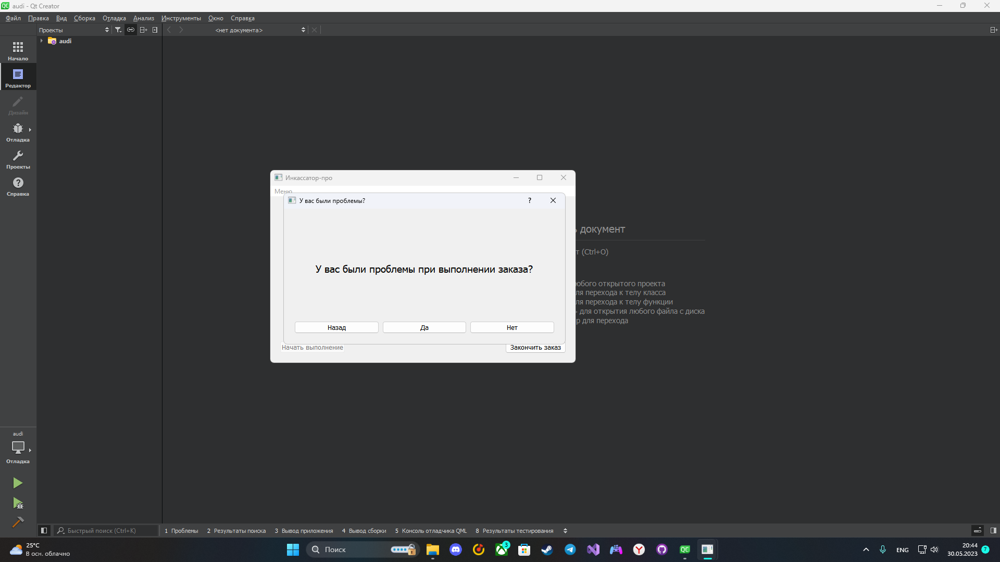
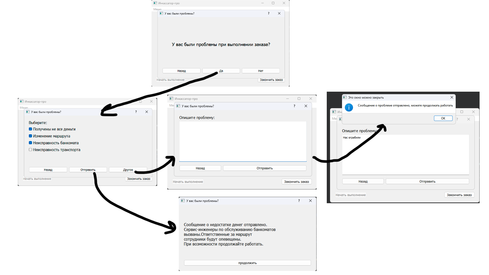
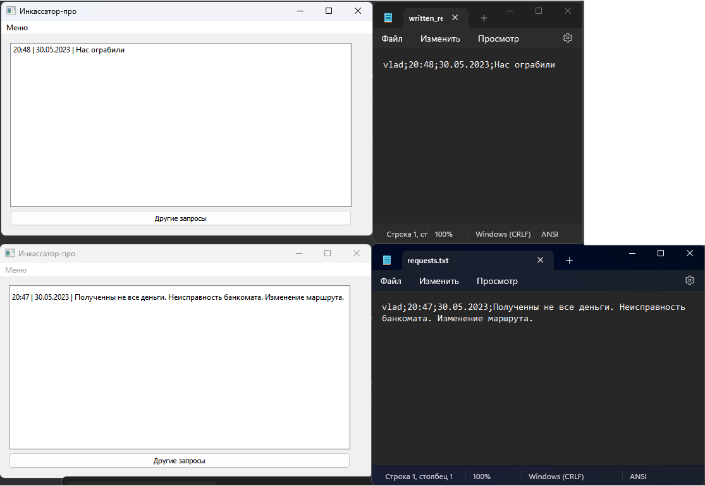
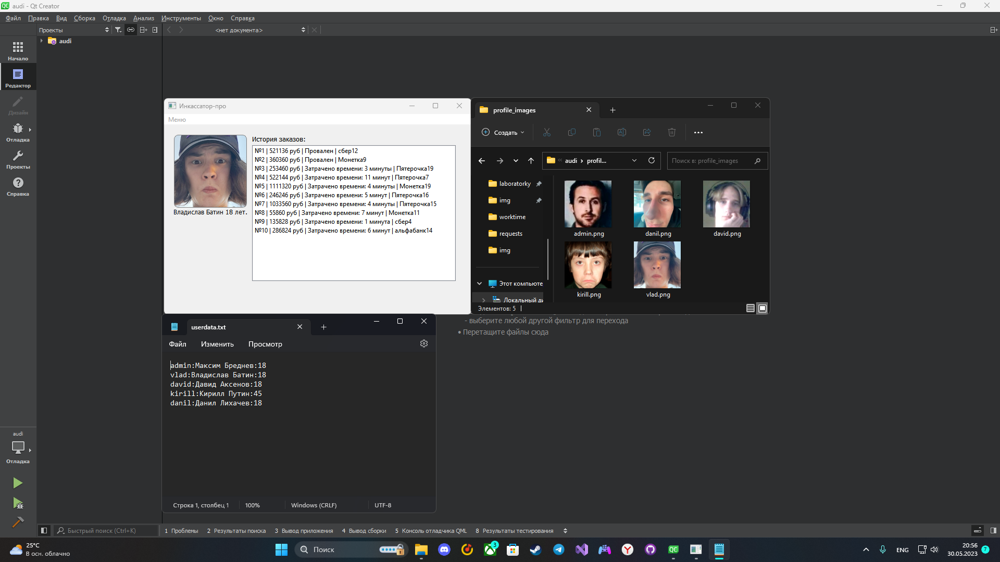
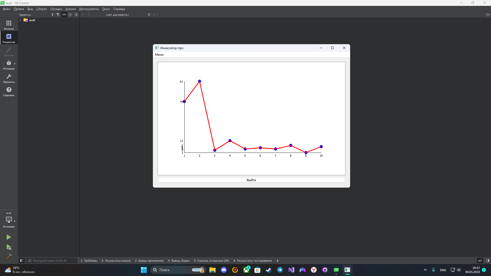
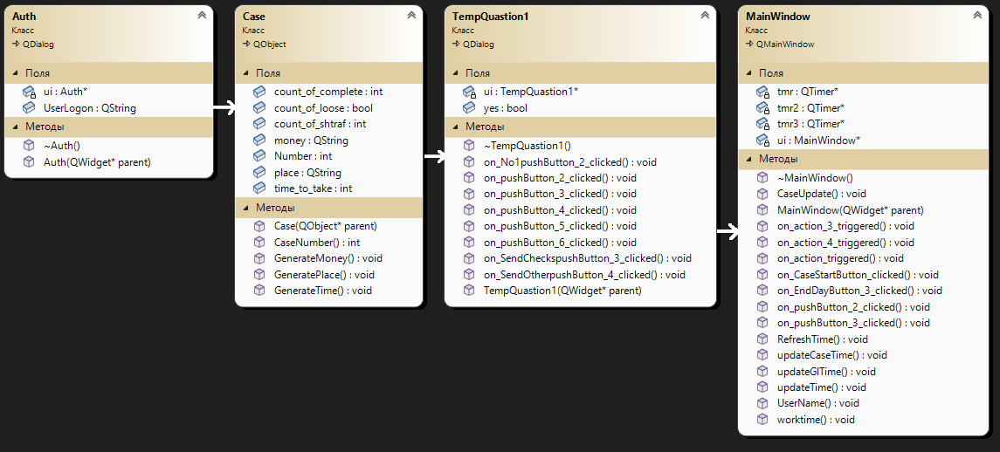

# Автоматизированное рабочее место специалиста
## Постановка задачи
Реализовать Автоматизированное Рабочее Место специалиста (АРМ) - инкассатора.
Данное АРМ должно выполнять функции:
- Опросник.
- Хранить список проблем, возникших при выполнении заказа.
- Хранить список данных для авторизации работников.
- Хранить данные для авторизации работников.
- Хранить данные о работниках.
- Хранить время начала и конца работы пользователя.
- Представлять график для отображения статистики выполнения заказов.
- Программа должна управляться событиями.

## Анализ задачи
- Для управления событиями будет использоваться фреймворк QT. Данный фреймворк предоставляет большое количество встроенных методов и библиотек, которые сильно ускорят разработку программы.
- Для создания опросника можно использовать отдельное окно, с возможность. выбора проблем, либо окно с полем ввода, чтобы пользователь мог описать частную проблему. После выбора проблем, программа будет обрабатывать их, записывать в файлы и выдавать пользователю рекомендации.
- Для хранения данных авторизации, будет создана база данных с логинами и паролями, она будет связана с другими базами данных, в которых будет хранится информация о пользователях.
- Для построения графика будут использованы библиотеки ```QVector```, ```QPointF``` и ```QGraphicsEllipseItem```.

## Тестирование
Программа выполнена модульно, поэтому для выполнения тестирования необходимо протестировать отдельно взятые методы.
Тестирование программы представленно в видео на YouTube: https://youtu.be/TYLQ-wuLbX4


## Сборка и запуск
Для того, чтобы запустить данную программу необходимо склонировать репозиторий:
```
gh repo clone der-pascal-enjoyer/ARM
```
Далее открыть файл ```.\audi\audi.pro``` и скомпилировать программу. Для корректного запуска необходима стандартная поставка QT версии ```QT5.12.12```


## Выполнение программы


Рис. 1 - Окно авторизации + логины и пароли в файлах.

Рис. 2 - Окно начала рабочего дня.

Рис. 3 - Сохранение данных авторизации в логах.

Рис. 4 - Меню приложения + главный экран.

Рис. 5 - Первое окно диалога.

Рис. 6 - Следующие диалоговые окна запросов.

Рис. 7 - Отображение запросов в программе + сохранение запросов в файлах.

Рис. 8 - Профиль с информацией, фотографией и списком выполненных заказов + данные в файлах.

Рис. 9 - График отображающий статистику выполнения заказов (время/заказы).

Рис. 10 - Диаграмма классов.

## Исходный код

Исходный код представлен в репозитории: https://github.com/pascal-enjoyer/ARM/tree/1ef7e95742242e5e2ecca10932cecf7586df616f/audi