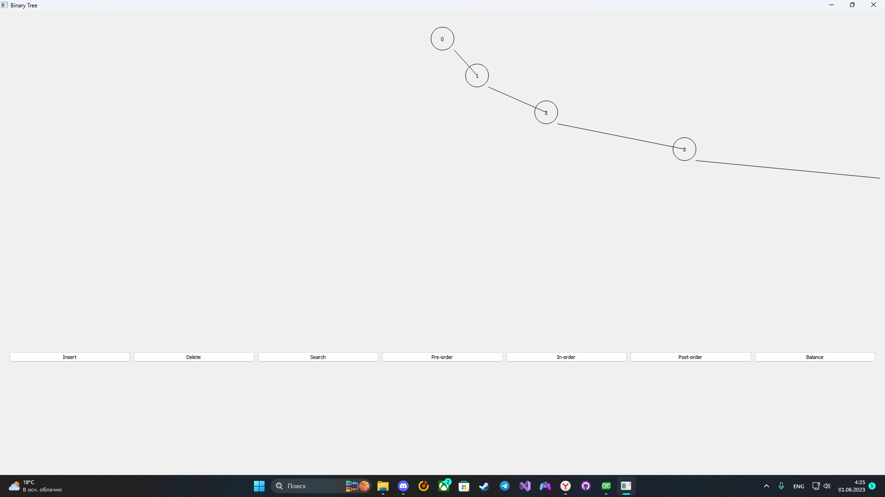
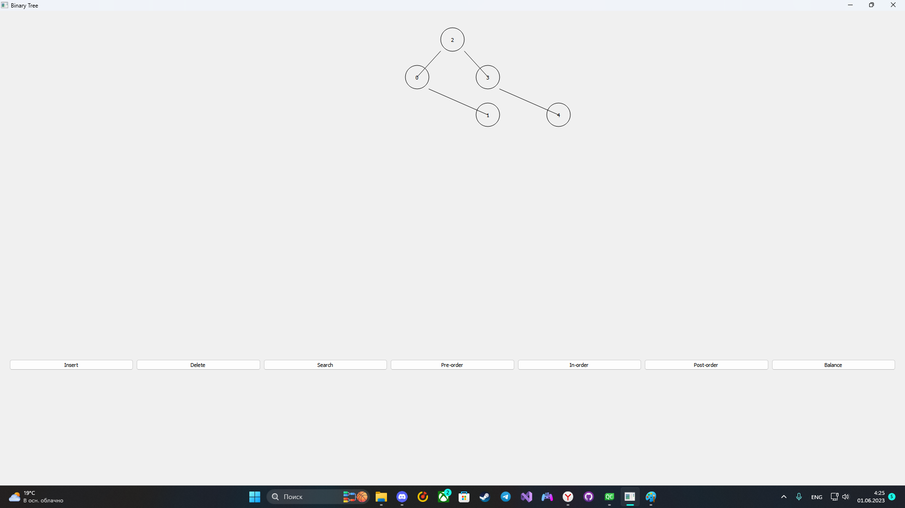
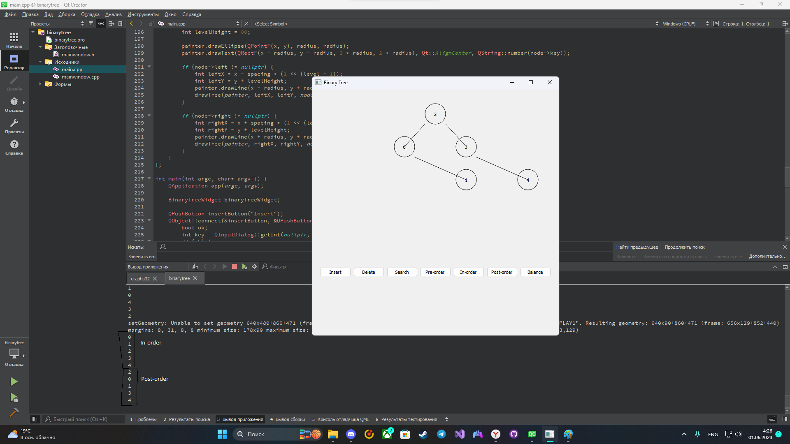
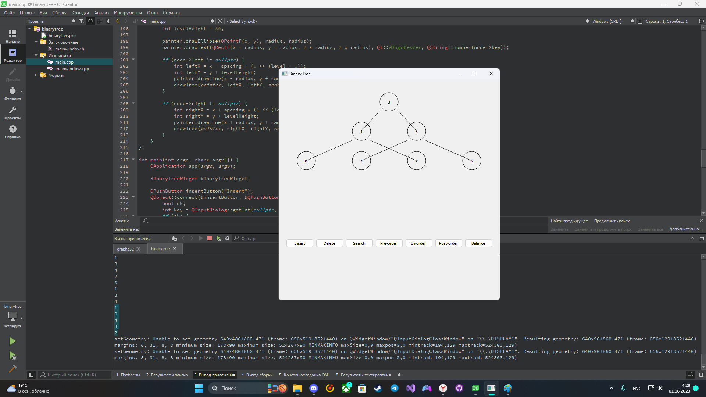

# Деревья
---
## Постановка задачи
Реализовать бинарное дерево.
Для решения данной задачи необходимо:
- Создать класс BinaryTreeWidget.
- Реализовать функции добавления и удаления узлов.
- Реализовать балансировку дерева.
- Визуализоровать дерево.
- Реализовать Интерфейс в Qt Creator.
---
## Анализ задачи
- Для управления событиями будет использоваться фреймворк QT. Данный фреймворк предоставляет большое количество встроенных методов и библиотек, которые сильно ускорят разработку программы.
- Для отрисовки использовать библиотеку```<QPainter>```, которая содержит множество встроенных методов, облегчающих и ускоряющих процесс отрисовки дерева.
- Структура узла Node должна содержать 3 поля: key - значение; left,right - указатели на дочерние 2 элемента.
- Класс ```BinaryTreeWidget.``` , содержит методы работы с графом: Добавление/Удаление, поиск узлов, балансировка, а также функции, выполняющие обходы: прямой, симметричный и обратный.
- Для работы с деревом использовать кнопки оконного приложения.
- Для визуализации задачи будет отрисовываться само бинарное дерево.
 
___
## Тестирование
Для тестирования программы необходимо протестировать решение решение задачи и визуализацию на разном количестве узлов.


___
## Сборка и запуск
Для того, чтобы запустить данную программу необходимо склонировать репозиторий:
```
gh repo clone pascal-enjoyer/ARM/binarytree/
```
Далее открыть файл ```BinTree/binarytree.pro``` и скомпилировать программу.
___
## Выполнение программы


Рис. 1 - Интерфейс программы + добавлении вершин.

Рис. 2 - Результат работы балансировки дерева.

Рис. 3 - Результат работы прямого и обратного обходов.

Рис. 4 - Результат работы симметричного обхода.

Рис. 5 - Диаграмма классов.


___
## Исходный код

Исходный код представлен в репозитории: https://github.com/pascal-enjoyer/ARM/tree/main/binarytree