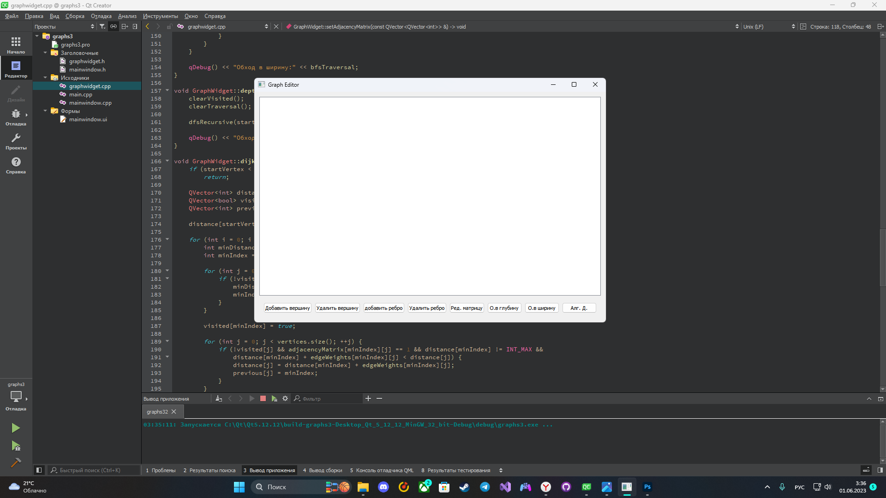
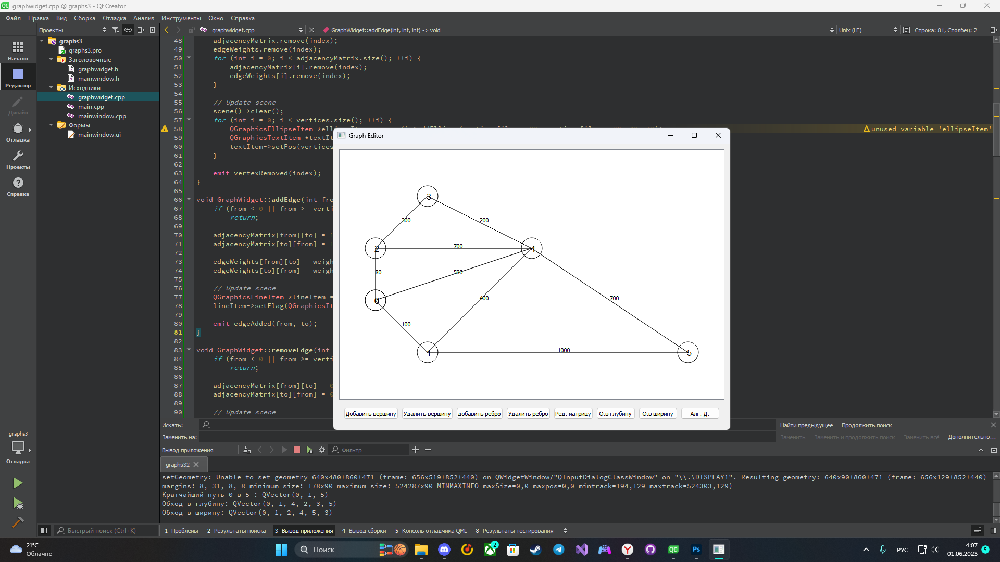
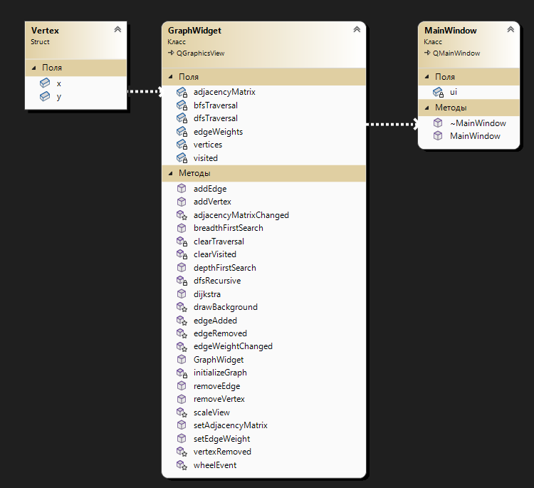

# Задача комивояжера
## Постановка задачи
Реализовать граф со следующими методами:
- Обход в ширину.
- Обход в глубину. 
- Алгоритм Дейкстры.
- Создание новой вершины.
- Удаление вершины.
- Добавление и удаление ребра.
- Редактирование весов ребер.
- Редактирование матрицы смежности (или инцидентности в зависимости от реализации).

## Анализ задачи
- Графы отрисовываются с помощью базовых библиотек ```QPainter``` и ```QtMath```, а также созданных методов ```addEdge``` и ```addVertex```.
- Для реализации методов был создан класс GraphWidget.
- Для визуализации использова фреймворк ```QT```, вершины графа отрисовываются по координатам.
- Для реализации обходов в глубину, в ширину и алгоритма Дейкстры были созданы методы ```breadthFirstSearch```, ```depthFirstSearch``` и ```dijkstra```, результат выводится в консоли QT.
 

## Тестирование
Для тестирования программы необходимо выполнить тесты решения задачи и визуализации на разном количестве вершин.
Тестирование программы представлено в виде скриншотов.


## Сборка и запуск
Для того, чтобы запустить данную программу необходимо склонировать репозиторий:
```
gh repo clone pascal-enjoyer/ARM/Graphs/
```
Далее открыть файл ```./Graphs.pro``` и скомпилировать программу.

## Выполнение программы


Рис. 1 - Интерфейс программы.

Рис. 2 - Результат работы обходов и алгоритма Дейкстры.

Рис. 3 - Диграмма классов.

## Исходный код

Исходный код представлен в репозитории: https://github.com/pascal-enjoyer/ARM/tree/main/Graphs
