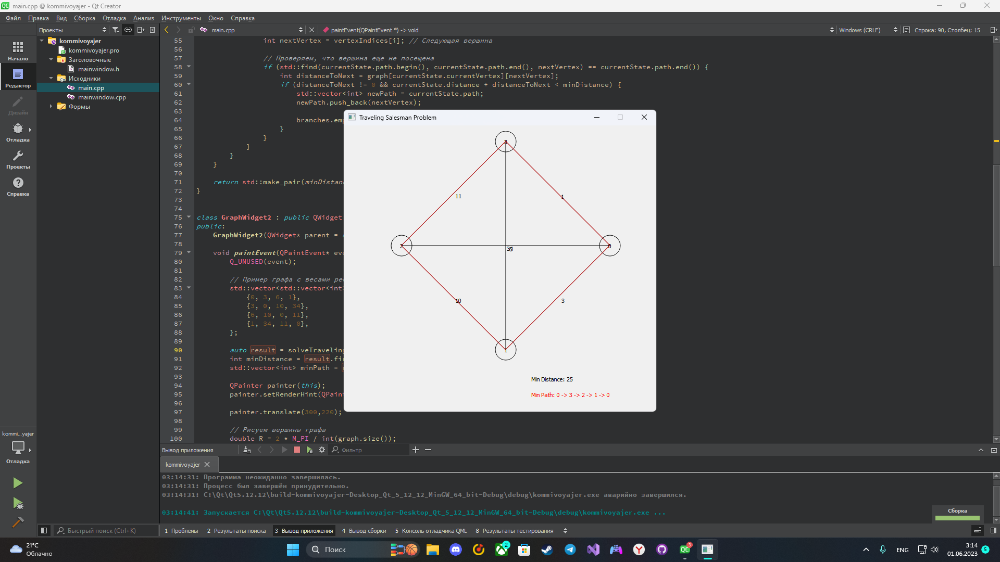

# Задача комивояжера
## Постановка задачи
Реализовать граф и решить для него задачу Комивояжера методом ветвей и границ.
Для решения данной задачи необходимо:
- Создать класс GraphWidget.
- Решить для данного графа задачу Комивояжера.
- Визуализировать граф.
- Визуализировать решение задачи Комивояжера.

## Анализ задачи
- Графы отрисовываются с помощью базовых библиотек ```QPainter``` и ```QtMath```.
- Для решения задачи комивояжера использован метод ветвей и границ, который находит локально-оптимальное решение для данного графа. Но при решении внесены правки - такие как установка стартовой вершины. Для этого вершина принудительно добавляется в массив индексов, который представляет из себя маршрут по вершинам. 
- Для визуализации использова фреймворк ```QT``` Вершины графа отрисовываются по кругу, от вершины к вершине проходит ребро в виде линии. Также по середине ребра располагается его вес, а на вершинах индексы вершин.
- Для визуализации решения задачи Комивояжера самый короткий путь окрашивается в красный, на экран выводится сумма весов ребер и путь по индексам.
 

## Тестирование
Для тестирования программы необходимо выполнить тесты решения задачи и визуализации на разном количестве вершин.
Тестирование программы представленно в видео на YouTube и в скриншотах ниже: https://youtu.be/3XvmPM502Y8


## Сборка и запуск
Для того, чтобы запустить данную программу необходимо склонировать репозиторий:
```
gh repo clone pascal-enjoyer/ARM/kommivoyajer/
```
Далее открыть файл ```./kommivoyajer.pro``` и скомпилировать программу.

## Выполнение программы


Рис. 1 - Визуализация решения задачи с 6 вершинами.

Рис. 2 - Визуализация решения задачи с 5 вершинами.

Рис. 3 - Визуализация решения с 4 вершинами.

Рис. 4 - Диаграмма классов.

## Исходный код

Исходный код представлен в репозитории: https://github.com/pascal-enjoyer/ARM/tree/main/kommivoyajer